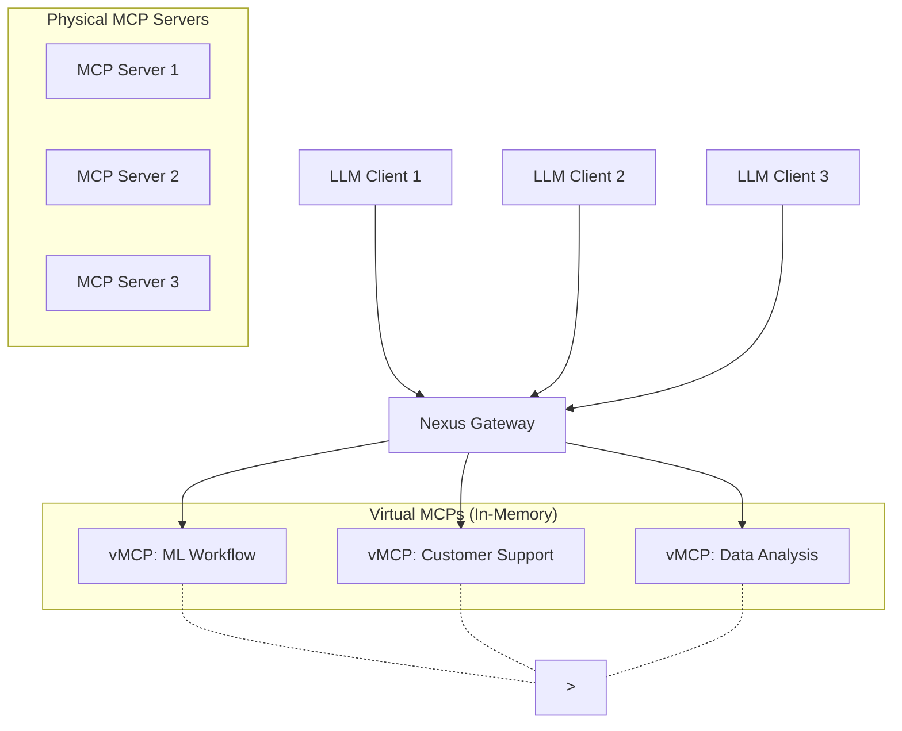

# Nexus: Centralized MCP Orchestration Platform

Nexus is an enterprise-grade orchestration platform that unifies distributed Model Context Protocol (MCP) servers into a centralized, secure ecosystem. By introducing Virtual MCP (vMCP) instances, Nexus enables organizations to create lightweight, purpose-specific tool collections while maintaining a single point of access for AI agents and applications.

## Features

- **Centralized MCP Aggregation**: Single connection point for all MCP servers
- **Virtual MCP Instances**: Lightweight, ephemeral environments with curated tool selections
- **Real-time Communication**: Server-Sent Events (SSE) for low-latency interactions
- **Dynamic Tool Discovery**: Automatic indexing and deduplication of tools across servers
- **Enterprise Security**: Role-based access control and audit logging
- **Performance Optimization**: Three-tier caching system and connection pooling

## MCP Server Capabilities

MCP servers can provide three main types of capabilities:

1. **Tools**: Executable functions that can be invoked by LLMs (with user approval)
   - Model-controlled operations
   - Input validation and error handling
   - Progress reporting for long operations

2. **Prompts**: Reusable templates and workflows
   - User-controlled selection
   - Dynamic arguments support
   - Context integration from resources

3. **Resources**: Data and content exposure
   - File-like data access
   - API responses
   - System information

## Architecture



## Components

### 1. Gateway Layer
- Handles client connections and request routing
- Implements SSE for real-time communication
- Manages authentication and authorization

### 2. vMCP Manager
- Creates and manages ephemeral MCP instances
- Handles resource allocation and cleanup
- Implements dynamic port management

### 3. Tool Registry
- Maintains an index of available tools
- Handles tool discovery and deduplication
- Provides semantic search capabilities

### 4. Security Layer
- Implements OAuth 2.0 authentication
- Manages role-based access control
- Provides audit logging

## Prerequisites

- Node.js 16 or higher
- TypeScript 4.9 or higher
- npm 7 or higher

## Installation

1. Clone the repository:
```bash
git clone https://github.com/your-org/nexus-mcp.git
cd nexus-mcp
```

2. Install dependencies:
```bash
npm install
```

3. Build the project:
```bash
npm run build
```

## Configuration

Create a `config.json` file in the root directory:

```json
{
  "port": 3000,
  "persistence": {
    "type": "memory", // or "database"
    "database": {
      "type": "postgres", // or "mongodb", "mysql"
      "host": "localhost",
      "port": 5432,
      "database": "nexus",
      "username": "nexus_user",
      "password": "your-password",
      "ssl": false
    }
  },
  "mcpServers": {
    "static": [
      {
        "name": "server1",
        "url": "http://localhost:3001",
        "auth": {
          "type": "oauth2",
          "clientId": "your-client-id",
          "clientSecret": "your-client-secret"
        }
      }
    ],
    "discovery": {
      "enabled": true,
      "interval": 300, // seconds
      "timeout": 30, // seconds
      "retries": 3
    }
  },
  "vMCP": {
    "maxInstances": 10,
    "memoryLimit": "50MB",
    "portRange": {
      "start": 3000,
      "end": 4000
    }
  }
}
```

### Dynamic MCP Server Management

Nexus provides a REST API for managing MCP servers dynamically:

```typescript
// Add a new MCP server
await fetch('http://localhost:3000/api/mcp-servers', {
  method: 'POST',
  headers: { 'Content-Type': 'application/json' },
  body: JSON.stringify({
    name: "new-server",
    url: "http://localhost:3002",
    auth: {
      type: "oauth2",
      clientId: "new-client-id",
      clientSecret: "new-client-secret"
    }
  })
});

// List all MCP servers
const servers = await fetch('http://localhost:3000/api/mcp-servers').then(r => r.json());

// Remove an MCP server
await fetch('http://localhost:3000/api/mcp-servers/server-name', {
  method: 'DELETE'
});
```

### Persistence Options

1. **In-Memory (Default)**
   - Fastest performance
   - No additional dependencies
   - Data lost on server restart
   - Suitable for development and testing

2. **Database**
   - Persistent storage across restarts
   - Supports multiple database types
   - Automatic schema migrations
   - Transaction support for consistency

The persistence layer is abstracted through a common interface, making it easy to add new storage backends:

```typescript
interface PersistenceProvider {
  saveMCPServer(server: MCPServer): Promise<void>;
  getMCPServers(): Promise<MCPServer[]>;
  removeMCPServer(name: string): Promise<void>;
  // ... other persistence methods
}
```

## API Reference

### MCP Server Management

```typescript
// List all MCP servers
GET /api/mcp-servers
Response: MCPServer[]

// Get a specific MCP server
GET /api/mcp-servers/:name
Response: MCPServer

// Add a new MCP server
POST /api/mcp-servers
Body: {
  name: string;
  url: string;
  auth?: {
    type: "oauth2";
    clientId: string;
    clientSecret: string;
  };
}
Response: MCPServer

// Update an MCP server
PUT /api/mcp-servers/:name
Body: Partial<MCPServer>
Response: MCPServer

// Remove an MCP server
DELETE /api/mcp-servers/:name
Response: void

// Test MCP server connection
POST /api/mcp-servers/:name/test
Response: { status: "ok" | "error", message?: string }
```

### vMCP Instance Management

```typescript
// List all vMCP instances
GET /api/vmcps
Response: vMCPInstance[]

// Get a specific vMCP instance
GET /api/vmcps/:id
Response: vMCPInstance

// Create a new vMCP instance
POST /api/vmcps
Body: {
  name: string;
  description?: string;
  tools: {
    name: string;
    server: string;  // MCP server name
    config?: Record<string, unknown>;
  }[];
  resources?: {
    uri: string;
    server: string;
  }[];
}
Response: vMCPInstance

// Update a vMCP instance
PUT /api/vmcps/:id
Body: Partial<vMCPInstance>
Response: vMCPInstance

// Delete a vMCP instance
DELETE /api/vmcps/:id
Response: void

// Get vMCP instance status
GET /api/vmcps/:id/status
Response: {
  status: "running" | "stopped" | "error";
  port: number;
  memoryUsage: string;
  uptime: number;
}
```

### SSE Protocol Implementation

Each vMCP instance implements the MCP protocol over SSE as per the TypeScript SDK:

```typescript
// Example vMCP instance implementation
class vMCPInstance {
  private server: Server;
  private transport: SSEServerTransport;
  private port: number;

  async initialize() {
    // Create MCP server instance
    this.server = new Server({
      name: `vmcp-${this.id}`,
      version: "1.0.0"
    });

    // Allocate port dynamically
    this.port = await this.allocatePort();

    // Set up SSE transport
    this.transport = new SSEServerTransport({
      port: this.port,
      sessionHandler: this.handleNewSession
    });

    // Connect to underlying MCP servers
    await this.connectToMCPServers();

    // Start the server
    await this.server.connect(this.transport);
  }

  private async handleNewSession(sessionId: string) {
    // Handle new client connection
    const session = new Session(sessionId);
    
    // Set up message handlers
    session.onMessage(async (message) => {
      // Route message to appropriate MCP server
      const response = await this.routeToMCPServer(message);
      session.send(response);
    });
  }

  private async routeToMCPServer(message: Message) {
    // Route message to appropriate MCP server based on tool/resource mapping
    const targetServer = this.getTargetServer(message);
    return await targetServer.handleMessage(message);
  }
}
```

### Example Usage

```typescript
// Create a new vMCP instance
const vmcp = await fetch('http://localhost:3000/api/vmcps', {
  method: 'POST',
  headers: { 'Content-Type': 'application/json' },
  body: JSON.stringify({
    name: "data-analysis",
    tools: [
      {
        name: "query-database",
        server: "postgres-mcp"
      },
      {
        name: "analyze-data",
        server: "pandas-mcp"
      }
    ]
  })
}).then(r => r.json());

// Connect to the vMCP instance using MCP client
const client = new Client({
  name: "data-analysis-client",
  version: "1.0.0"
});

const transport = new SSEClientTransport({
  url: `http://localhost:${vmcp.port}/sse`
});

await client.connect(transport);

// Use the tools
const result = await client.callTool({
  name: "query-database",
  arguments: {
    query: "SELECT * FROM users"
  }
});
```

## Usage

1. Start the Nexus server:
```bash
npm start
```

2. Connect to the server using an MCP client:
```typescript
import { Client } from "@modelcontextprotocol/sdk/client";
import { SSEClientTransport } from "@modelcontextprotocol/sdk/client/sse";

const client = new Client({
  name: "example-client",
  version: "1.0.0"
});

const transport = new SSEClientTransport({
  url: "http://localhost:3000/sse"
});

await client.connect(transport);
```

## Development

1. Start the development server:
```bash
npm run dev
```

2. Run tests:
```bash
npm test
```

3. Build for production:
```bash
npm run build
```

## Contributing

1. Fork the repository
2. Create your feature branch (`git checkout -b feature/amazing-feature`)
3. Commit your changes (`git commit -m 'Add some amazing feature'`)
4. Push to the branch (`git push origin feature/amazing-feature`)
5. Open a Pull Request

## License

This project is licensed under the MIT License - see the [LICENSE](LICENSE) file for details.

## Acknowledgments

- [Model Context Protocol](https://modelcontextprotocol.io/)
- [MCP TypeScript SDK](https://github.com/modelcontextprotocol/typescript-sdk) 