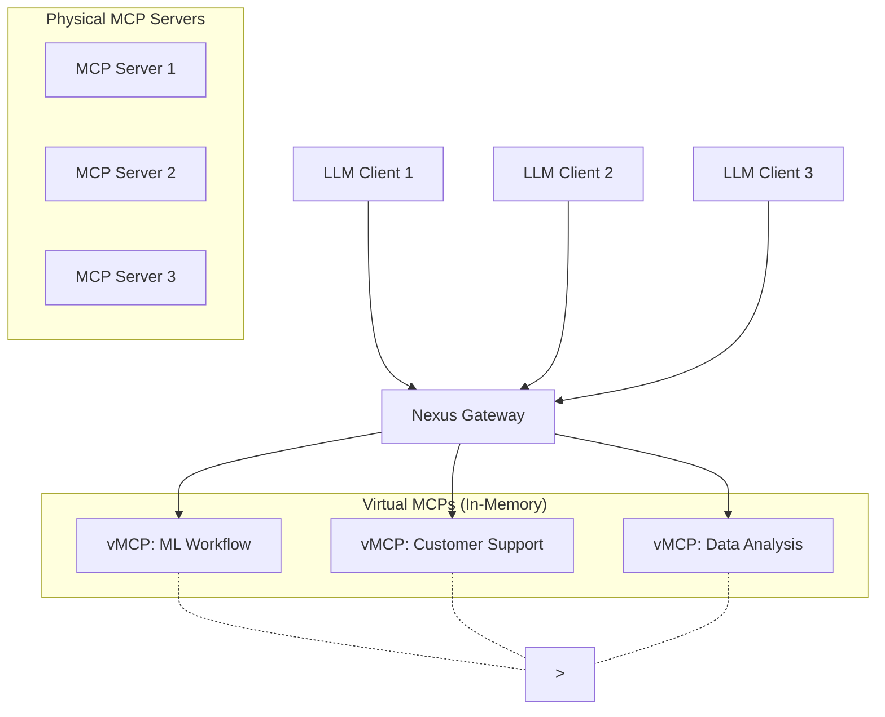

# Nexus: Centralized MCP Orchestration Platform

Nexus is an enterprise-grade orchestration platform that unifies distributed Model Context Protocol (MCP) servers into a centralized, secure ecosystem. By introducing Virtual MCP (vMCP) instances, Nexus enables organizations to create lightweight, purpose-specific tool collections while maintaining a single point of access for AI agents and applications.

## Features

- **Centralized MCP Aggregation**: Single connection point for all MCP servers
- **Virtual MCP Instances**: Lightweight, ephemeral environments with curated tool selections
- **Real-time Communication**: Server-Sent Events (SSE) for low-latency interactions
- **Dynamic Tool Discovery**: Automatic indexing and deduplication of tools across servers
- **Enterprise Security**: Role-based access control and audit logging
- **Performance Optimization**: Three-tier caching system and connection pooling

## MCP Server Capabilities

MCP servers can provide three main types of capabilities:

1. **Tools**: Executable functions that can be invoked by LLMs (with user approval)
   - Model-controlled operations
   - Input validation and error handling
   - Progress reporting for long operations

2. **Prompts**: Reusable templates and workflows
   - User-controlled selection
   - Dynamic arguments support
   - Context integration from resources

3. **Resources**: Data and content exposure
   - File-like data access
   - API responses
   - System information

## Architecture



## Components

### 1. Gateway Layer
- Handles client connections and request routing
- Implements SSE for real-time communication
- Manages authentication and authorization

### 2. vMCP Manager
- Creates and manages ephemeral MCP instances
- Handles resource allocation and cleanup
- Implements dynamic port management

### 3. Tool Registry
- Maintains an index of available tools
- Handles tool discovery and deduplication
- Provides semantic search capabilities

### 4. Security Layer
- Implements OAuth 2.0 authentication
- Manages role-based access control
- Provides audit logging

## Prerequisites

- Node.js 16 or higher
- TypeScript 4.9 or higher
- npm 7 or higher

## Installation

1. Clone the repository:
```bash
git clone https://github.com/your-org/nexus-mcp.git
cd nexus-mcp
```

2. Install dependencies:
```bash
npm install
```

3. Build the project:
```bash
npm run build
```

## Usage

### Starting the Server

```bash
npm start
```

This will start the Nexus MCP server on the default port (3000).

### Development Mode

```bash
npm run dev
```

This will start the server in development mode with hot reloading.

## Project Structure

```
nexus-mcp/
├── bin/            # CLI scripts
├── client/         # Web client application
├── server/         # Server application
├── Docs/           # Documentation
└── package.json    # Root package.json
```

For more detailed information about each component, see:
- [Server README](server/README.md)
- [Client README](client/README.md)

## API Documentation

The API documentation is available at `/api-docs` when the server is running.

## Contributing

1. Fork the repository
2. Create a feature branch
3. Commit your changes
4. Push to the branch
5. Create a Pull Request

## License

This project is licensed under the MIT License - see the LICENSE file for details.

## Acknowledgments

- [Model Context Protocol](https://modelcontextprotocol.io/) for the protocol specification
- [Express.js](https://expressjs.com/) for the web framework
- [React](https://reactjs.org/) for the client UI framework 